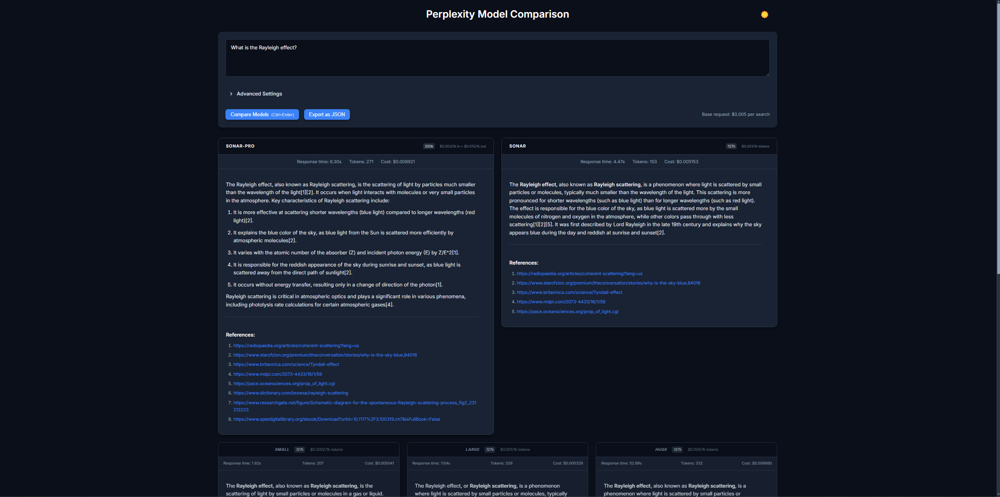
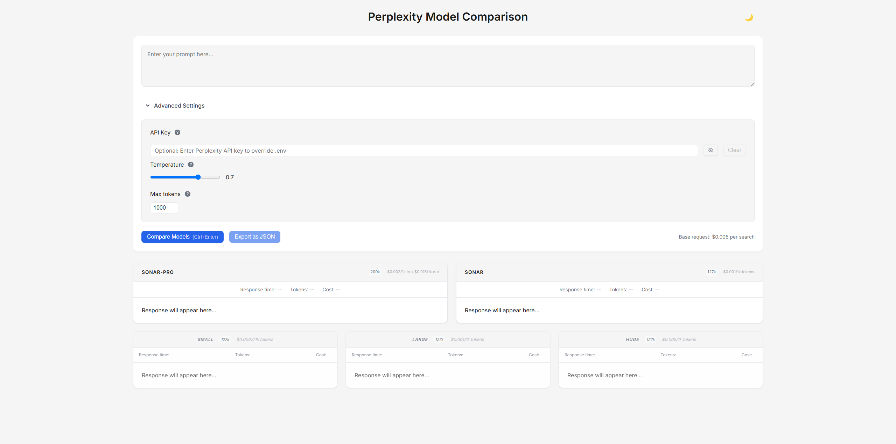

# Perplexity API Model Comparison Tool

An experimental developer tool for comparing different Perplexity AI models side by side. Built to help developers evaluate and choose the right model for their applications by comparing responses, costs, and performance.

## Quick Start

```bash
# Clone the repository
git clone https://github.com/jsandai/pplx-api-compare.git

# Enter the project directory
cd pplx-api-compare

# Install dependencies
npm install

# Create your .env file from the example
cp .env.example .env

# Get your API key from: https://docs.perplexity.ai/
# Add your Perplexity API key to .env - alternatively paste it directly into the field within advanced settings
# Start the development server

npm run dev
```

The application will be available at `http://localhost:3000` by default (or the next available port if 3000 is in use).



## Features

- Compare responses from multiple Perplexity models simultaneously
- Real-time cost calculation and token usage monitoring
- Support for both Sonar and legacy models
- Dark/Light theme support
- Markdown rendering for responses
- Export results as JSON
- Configurable parameters (temperature, max tokens)
- API key management with local storage
- Responsive design for all screen sizes

## Purpose

This tool is designed for developers to:
- Test how different models respond to the same prompt
- Compare response quality and characteristics
- Understand the cost implications of each model
- Make informed decisions about which model best fits their needs

Note: This is an experimental developer utility, not intended for production use.

### Advanced Settings

The application includes configurable parameters for fine-tuning your comparisons:



## Models Supported

- Sonar Pro (200k context)
  - Note: May perform multiple searches per request, each incurring the base cost
- Sonar (127k context)
  - Performs a single search per request
- Legacy Models (127k context):
  - llama-3.1-sonar-small-128k-online
  - llama-3.1-sonar-large-128k-online
  - llama-3.1-sonar-huge-128k-online

## Cost Estimation Notes

- Base request cost: $0.005 per search
- Sonar: Performs one search per request, making cost estimation straightforward
- Sonar Pro: May perform multiple searches per request
  - Each additional search incurs the base cost
  - The exact number of searches performed is not provided in the API response
  - Actual costs may be higher than the displayed estimate
- Token costs are accurately tracked for all models

https://docs.perplexity.ai/guides/model-cards

## Development Notes

When running `npm install`, you may see several deprecation warnings related to ESLint's dependencies. These warnings are:
- Coming from ESLint's internal dependencies
- Don't affect the functionality of the application
- Will be resolved in future ESLint updates
- Can be safely ignored for this experimental tool

## Requirements

- Node.js >= 18.0.0
- npm (comes with Node.js)
- Perplexity API key

## License

This project is licensed under the MIT License - see the [LICENSE](LICENSE) file for details.
